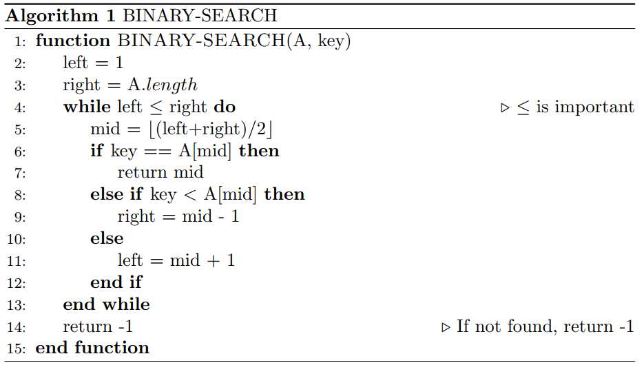

[TOC]

# Exercise 2.3-5

*Problem*: Referring back to the searching problem (see Exercise 2.1-3), observe that if the sequence A is sorted, we can check the midpoint of the sequence against v and eliminate half of the sequence from further consideration. **Binary search** is an algorithm that repeats this procedure, halving the size of the remaining portion of the sequence each time. Write pseudo code, either iterative or recursive, for binary search. Argue that the worst-case running time of binary search is $\Theta(\log n)$. 

**Solution**

可以按照书中那样把递归树画出来，这里每一层只有一个分支，所以每层的开销都为常数时间$c$，因此二分查找的复杂度为树的高度$\log n$乘以每层的时间开销$c$：
$$
\begin{align}
T(n) &= T(n/2) + c\\
T(n) &= \Theta(\log n)
\end{align}
$$

> 如果准确算的话应该是树的高度加1，but anyway :)
